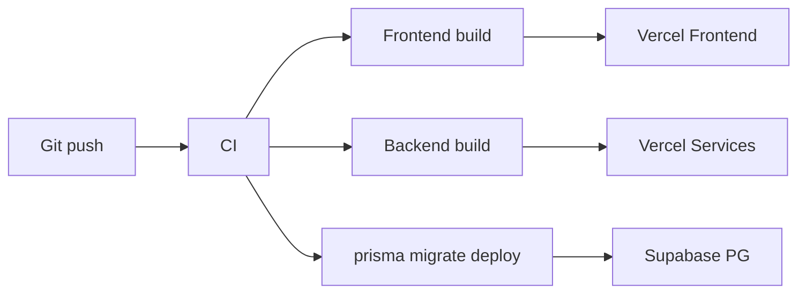

# JobTrack AI — Deploy

Guia de deploy para ambientes de produção. Docker local **não** é usado em produção.

## Visão geral

| Componente | Plataforma | Observação |
|------------|------------|------------|
| Frontend | Vercel | Next.js 15, root dir `frontend` |
| Backend | Vercel Services | Node.js serverless / functions |
| Banco | Supabase | PostgreSQL gerenciado |
| Cache | React Query (client) | Sem Redis no MVP |

## Frontend (Vercel)

1. Conectar repositório Git à Vercel.
2. Configurar **Root Directory:** `frontend`
3. Framework preset: **Next.js**
4. Build command: `pnpm build` (ou usar [`vercel.json`](../vercel.json) na raiz)
5. Install command: `pnpm install`

### Variáveis de ambiente (produção)

| Variável | Descrição |
|----------|-----------|
| `NEXT_PUBLIC_API_URL` | URL pública da API (ex.: `https://api.jobtrack.ai`) |
| `NEXT_PUBLIC_ENABLE_MSW` | `false` em produção |

## Backend (Vercel Services)

1. Deploy do diretório `backend` como projeto Node separado ou integrado ao monorepo conforme configuração Vercel.
2. Build: `npm run build` → `dist/`
3. Start: `npm run start` ou handler serverless conforme adapter.

### Variáveis de ambiente (produção)

| Variável | Obrigatória | Descrição |
|----------|-------------|-----------|
| `NODE_ENV` | Sim | `production` |
| `DATABASE_URL` | Sim | Connection string Supabase PostgreSQL |
| `JWT_SECRET` | Sim | Segredo forte (nunca commitar) |
| `JWT_ACCESS_EXPIRES_IN` | Não | Padrão `15m` |
| `JWT_REFRESH_EXPIRES_IN` | Não | Padrão `7d` |
| `FRONTEND_URL` | Sim | URL do frontend (CORS), ex.: `https://app.jobtrack.ai` |
| `GOOGLE_CLIENT_ID` | Sim* | OAuth Google |
| `GOOGLE_CLIENT_SECRET` | Sim* | OAuth Google |

\* Quando auth Google estiver ativo em produção.

## Banco (Supabase)

1. Criar projeto no Supabase.
2. Copiar `DATABASE_URL` (pooler ou direct conforme Prisma).
3. No CI ou local antes do deploy:

```bash
cd backend
npx prisma generate
npx prisma migrate deploy
```

Migrations não rodam automaticamente no Docker de dev — mesmo princípio em produção deve ser via pipeline explícito.

## Fluxo de build recomendado (CI futuro)



## Checklist pré-deploy

- [ ] `NEXT_PUBLIC_ENABLE_MSW=false` no frontend
- [ ] `JWT_SECRET` forte e rotacionado
- [ ] `FRONTEND_URL` e CORS alinhados
- [ ] `DATABASE_URL` apontando para Supabase production
- [ ] Migrations Prisma aplicadas
- [ ] `ENABLE_V2_FEATURES=false` (WebSocket/Scheduler desligados no MVP)
- [ ] Health checks: `GET /health` (backend)

## Desenvolvimento local vs produção

| Aspecto | Local (Docker) | Produção |
|---------|----------------|----------|
| Frontend | `localhost:3000` | Domínio Vercel |
| API | `localhost:3333` | Domínio API |
| Banco | Postgres container | Supabase |
| Mocks | MSW apenas em testes | Desligado |

## Referências

- [ARCHITECTURE.md](./ARCHITECTURE.md)
- [DECISIONS.md](./DECISIONS.md)
- [README.md](../README.md)
