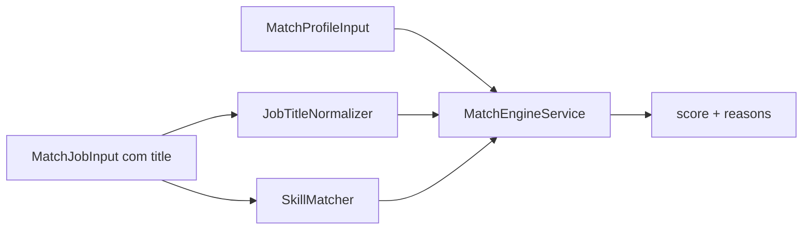

# Match Engine — JobTrack AI

Documentação oficial do algoritmo de compatibilidade perfil × vaga.

**Versão ativa:** `rules-v2` (`MATCH_ENGINE_VERSION`)

---

## Visão geral

O Match Engine calcula um score de 0–100 e gera `reasons` explicando a compatibilidade. Toda recomendação (catálogo, dashboard, job details, vagas relacionadas) passa pelo `MatchEngineService` — nunca por heurísticas ad hoc no frontend.

---

## Normalização

### JobTitleNormalizer

Mapeia o **título da vaga** para uma área profissional usando aliases estáticos (ex.: "Platform Engineer" → `devops`, "React Developer" → `frontend`).

- Matching por frase normalizada (lowercase, sem acentos)
- **Maior alias vence** (ex.: "Software Engineer Frontend" → `frontend`, não `full_stack`)
- Quando `job.area` está definido no banco, ele é **autoritativo** para compatibilidade

### SkillMatcher

Aliases síncronos para tecnologias:

| Alias | Canônico |
|-------|----------|
| ReactJS | react |
| NodeJS | node-js |
| TS | typescript |
| JS | javascript |
| NextJS | next-js |

Slug compartilhado: `backend/src/shared/domain/skill-slug.ts`

O módulo AI (`SkillNormalizer`) usa o catálogo Prisma em runtime; o match engine usa `SkillMatcher` síncrono para performance em listagens.

---

## Pesos (`rules-v2`)

Configuráveis em `backend/src/shared/domain/match-weights.ts`:

| Fator | Peso | Notas |
|-------|------|-------|
| Base | 20 | Score inicial |
| Área (`job.area === profile.area`) | +35 | Dominante |
| Cargo/título inferido compatível | +25 | Quando `job.area` ausente |
| Skill em requirements | +10 cada | Obrigatória |
| Skill em technologies | +6 cada | Desejável |
| Senioridade compatível | +8 | Diferença ≤ 1 nível |
| Senioridade incompatível | -12 | |
| Modalidade | +6 | |
| Localização | +5 | |
| Salário | +4 | |
| **Área incompatível** | **cap ≤ 30** | Mesmo com 100% skills |

---

## Gate de área

Função `isAreaCompatible(profile, job)`:

1. Sem `profile.area` → compatível (sem filtro)
2. `job.area` definido → compatível somente se igual ao perfil
3. `job.area` ausente → inferir do título via `JobTitleNormalizer`
4. Sem área nem título reconhecível → compatível (não excluir por falta de dados)

**Exemplo:** Perfil Frontend + React; vaga DevOps + React → score ≤ 30, excluída do top jobs.

---

## Consumidores

| Módulo | Uso |
|--------|-----|
| `job-catalog` | Sort por match; pré-filtro por área |
| `dashboard` | Insight, atividades, top technologies |
| `jobs` | Match em detalhes e listagem |
| `ai` | Cache key inclui `MATCH_ENGINE_VERSION` |

---

## Reasons (PT)

Labels retornados ao frontend para `JobWhyThisJobCard` e `MatchReasonsList`:

- "Área compatível com seu perfil"
- "Cargo compatível com seu perfil"
- "{Skill} encontrado"
- "Senioridade compatível"
- "Modalidade compatível"
- "Localização compatível"
- "Pretensão compatível"
- "Área incompatível com seu perfil" (matched: false)

---

## Evolução

| Versão | Status |
|--------|--------|
| `rules-v1` | Substituída — skills dominavam (+15 cada) |
| `rules-v2` | Ativa — área e cargo dominam |

Ver ADR-029 em [DECISIONS.md](./DECISIONS.md).
